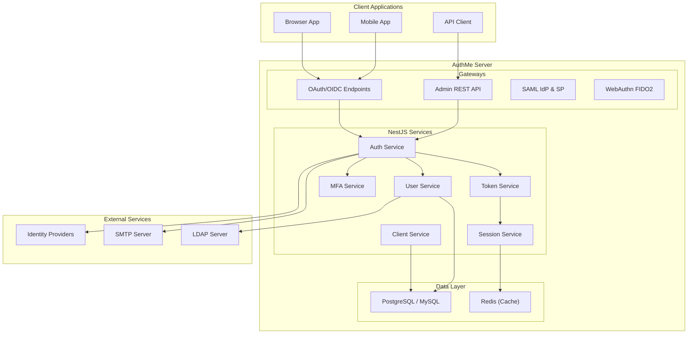
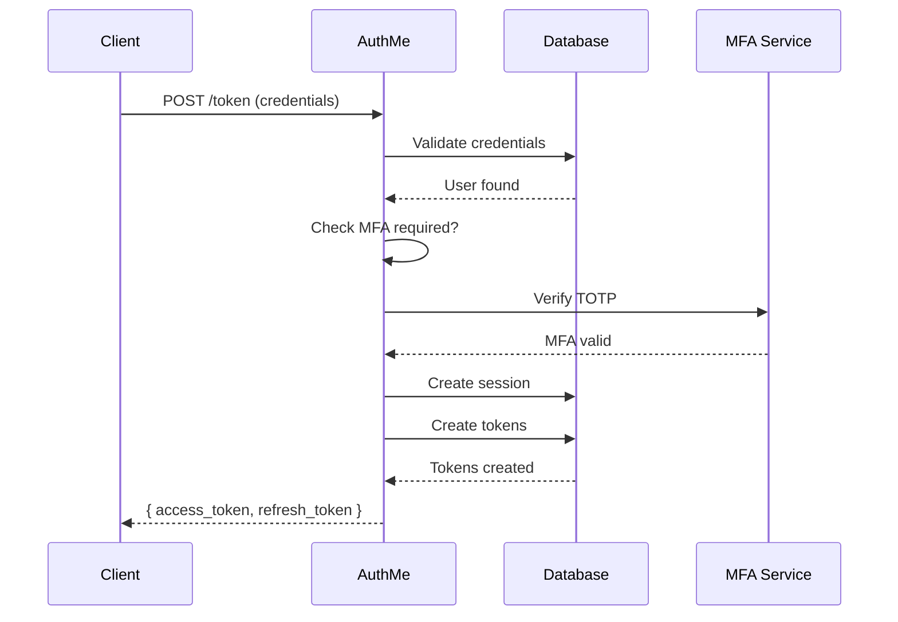

<p align="center">
  
</p>

<h1 align="center">AuthMe</h1>

<p align="center">
  <strong>Open-Source Identity & Access Management</strong><br />
  <sub>Self-hosted authentication server with OAuth 2.0, OpenID Connect, SAML 2.0, WebAuthn, and more.</sub>
</p>

<p align="center">
  <a href="https://authme.dev">Website</a> &middot;
  <a href="#features">Features</a> &middot;
  <a href="#quick-start">Quick Start</a> &middot;
  <a href="#client-sdks">SDKs</a> &middot;
  <a href="#cli">CLI</a> &middot;
  <a href="#architecture">Architecture</a> &middot;
  <a href="#api-documentation">API Docs</a>
</p>

<p align="center">
  <a href="https://github.com/Islamawad132/Authme/actions"></a>
  <a href="https://www.npmjs.com/package/authme-sdk"></a>
  <a href="https://www.npmjs.com/package/authme-cli"></a>
  <a href="https://hub.docker.com/r/islamawad/authme"></a>
  <a href="https://github.com/Islamawad132/Authme/blob/main/LICENSE"></a>
  <a href="https://authme.dev"></a>
</p>

---

## Why AuthMe?

Most identity solutions are either too complex to self-host (Keycloak — 1GB+ RAM, Java) or too limited for production (simple JWT libraries). AuthMe fills that gap:

- **Deploy in 30 seconds** — single `docker compose up` gets you a full IAM server
- **Modern stack** — TypeScript, NestJS, React, PostgreSQL. No Java, no XML
- **Lightweight** — runs in ~150 MB RAM vs. Keycloak's 1 GB+
- **Complete** — OAuth 2.0, OIDC, SAML 2.0, WebAuthn, MFA, LDAP, SSO, Organizations — all built-in
- **Extensible** — plugin system, custom auth flows, webhooks, and 10 client SDKs
- **Admin Console** — full-featured React dashboard at `/console`

---

## Features

### Authentication & Protocols

| Feature | Description |
|---------|-------------|
| **OAuth 2.0 / OpenID Connect** | Authorization Code (with PKCE), Client Credentials, Password, Refresh Token, and Device Authorization grants |
| **SAML 2.0** | Identity Provider and Service Provider with signed assertions and metadata exchange |
| **WebAuthn / Passkeys** | FIDO2 passwordless authentication with credential registration, biometric support, and platform authenticators |
| **Multi-Factor Authentication** | TOTP-based 2FA with QR provisioning, recovery codes, and brute-force protection |
| **Step-Up Authentication** | ACR levels (password, MFA, WebAuthn) requiring re-authentication for sensitive operations |
| **Adaptive / Risk-Based Auth** | Impossible travel detection, IP reputation scoring, device fingerprinting, and risk-based step-up or block |
| **Social Login** | Broker external OIDC and SAML identity providers (Google, GitHub, Azure AD, etc.) |
| **LDAP User Federation** | Sync users from LDAP/Active Directory with on-demand or scheduled sync |
| **Custom Auth Flows** | Configurable multi-step authentication flows with conditional branching and fallback logic |
| **Single Sign-On** | Browser-based SSO across all clients in a realm |
| **SCIM 2.0** | Complete Identity provisioning with Users, Groups, and Service Providers |
| **GraphQL API** | Full GraphQL API for users, realms, clients, and organizations |

### Identity Management

| Feature | Description |
|---------|-------------|
| **Multi-Tenancy (Realms)** | Isolated tenants with independent users, clients, roles, and configurations |
| **Organizations (B2B)** | Hierarchical organizations with member roles, SSO connections, and domain verification via DNS TXT |
| **Role-Based Access Control** | Realm-level and client-level roles with user and group assignments |
| **Policy-Based Authorization** | Attribute-Based Access Control (ABAC) for fine-grained permissions |
| **Groups** | Hierarchical groups with role inheritance |
| **Custom User Attributes** | Flexible schema (text, email, date, select, multiselect) with OIDC claim mapping |
| **Service Accounts & API Keys** | Stateless backend-to-backend authentication with key rotation and usage tracking |
| **Password Policies** | Minimum length, complexity requirements, history tracking, and expiry |
| **Brute Force Protection** | Automatic account lockout with configurable thresholds and duration |
| **Email Verification & Password Reset** | Configurable email flows via SMTP with themed templates |
| **Impersonation** | Admin impersonation with temporary tokens, max duration, and full audit trail |

### Admin Console

| Feature | Description |
|---------|-------------|
| **Modern React Dashboard** | Full-featured admin UI at `/console` with real-time stats |
| **Entity Management** | CRUD for realms, users, clients, roles, groups, scopes, organizations, and more |
| **Auth Flow Builder** | Visual configuration of custom multi-step authentication flows |
| **Session Management** | View and revoke active user sessions |
| **Event Audit Logs** | Login events and admin action history with filtering and export |
| **Identity Provider Config** | Configure OIDC, SAML, and LDAP providers from the UI |
| **Realm Import/Export** | Migrate configurations between environments |
| **Analytics Dashboard** | Active users (24h/7d/30d), login success/failure rates, session counts |

### Webhooks & Integrations

| Feature | Description |
|---------|-------------|
| **Outbound Webhooks** | Event-driven HTTP callbacks with AES-256-GCM encryption at rest |
| **Retry & Scheduling** | Async delivery with configurable retry policies and status tracking |
| **Plugin System** | Extensible plugin architecture with event listeners and token enrichment hooks |
| **Data Migration** | Built-in importers for Auth0 and Keycloak configurations |

### Operations & DevOps

| Feature | Description |
|---------|-------------|
| **Prometheus Metrics** | `/metrics` endpoint for Grafana dashboards |
| **Health Checks** | `/health/live` and `/health/ready` for load balancers and orchestrators |
| **Structured Logging** | JSON logging with Pino for log aggregation |
| **Rate Limiting** | Configurable request throttling per endpoint, per client, per user, and per IP |
| **Horizontal Scaling** | Stateless design — run multiple instances behind a load balancer |
| **Redis Support** | Optional Redis for session storage and caching (Sentinel support for HA) |
| **Multi-Database** | PostgreSQL (primary), MySQL, and SQLite support |
| **API Versioning** | Versioned API with deprecation and sunset headers (RFC 8594) |
| **CORS Management** | Dynamic origin validation with two-level caching (in-process + Redis) |
| **Realm Theming** | Custom logos, colors, and CSS per realm for login, consent, account, and email pages |

---

## Quick Start

### Docker Hub (Recommended)

```bash
curl -o docker-compose.yml https://raw.githubusercontent.com/Islamawad132/Authme/main/docker-compose.yml
docker compose up -d
```

That's it. AuthMe is now running:

| URL | Description |
|-----|-------------|
| http://localhost:3000/console | Admin Console |
| http://localhost:3000/api | Swagger API Docs |
| http://localhost:3000/health/live | Health Check |
| http://localhost:3000/metrics | Prometheus Metrics |

**Default admin credentials:**

| Field | Value |
|-------|-------|
| Username | `admin` |
| Password | `admin` |
| API Key | Value of `ADMIN_API_KEY` in `.env` |

> **Warning:** Change the default password and API key before exposing to the internet.

### From Source

**Prerequisites:** Node.js 22+, PostgreSQL 16+

```bash
git clone https://github.com/Islamawad132/Authme.git
cd Authme

# Install dependencies
npm install
cd admin-ui && npm install && cd ..

# Configure
cp .env.example .env
# Edit .env with your DATABASE_URL

# Setup database
npm run prisma:generate
npm run prisma:migrate
npm run prisma:seed   # Optional: sample data

# Build & start
npm run build:all
npm run start:prod
```

---

## Client SDKs

AuthMe provides official SDKs for every major platform:

| Package | Install | Description |
|---------|---------|-------------|
| [**authme-sdk**](packages/authme-js/) | `npm i authme-sdk` | Core TypeScript SDK with React bindings (~5 KB gzipped) |
| [**authme-nextjs**](packages/authme-nextjs/) | `npm i authme-nextjs` | Next.js SDK — App Router, middleware, Server Components |
| [**authme-angular**](packages/authme-angular/) | `npm i authme-angular` | Angular SDK — service, guard, HTTP interceptor |
| [**authme-vue**](packages/authme-vue/) | `npm i authme-vue` | Vue 3 SDK — composables, plugin, router guard |
| [**authme-android**](packages/authme-android/) | Gradle/Maven | Android SDK — Chrome Custom Tabs, encrypted storage, biometrics |
| [**authme-ios**](packages/authme-ios/) | Swift Package | iOS SDK — ASWebAuthenticationSession, Keychain, Face ID / Touch ID |
| [**authme-cli**](packages/authme-cli/) | `npm i -g authme-cli` | CLI tool — manage realms, users, and configurations from terminal |
| [**authme-python**](packages/authme-python/) | `pip install authme-python` | Python SDK — async client for Python 3.8+ applications |
| [**authme-go**](packages/authme-go/) | `go get github.com/authme-go/authme` | Go SDK — idiomatic Go client with context support |
| [**authme-java**](packages/authme-java/) | Maven/Gradle | Java SDK — Java 11+ client with Spring Boot integration |

### Quick Example (5 Lines to Authenticate)

```typescript
import { AuthmeClient } from 'authme-sdk';

const authme = new AuthmeClient({
  url: 'http://localhost:3000',
  realm: 'my-realm',
  clientId: 'my-app',
  redirectUri: 'http://localhost:5173/callback',
});

await authme.init();
if (!authme.isAuthenticated()) {
  await authme.login(); // Redirects to AuthMe login page
}
```

### React

```tsx
import { AuthmeClient } from 'authme-sdk';
import { AuthmeProvider, useAuthme, useUser } from 'authme-sdk/react';

const authme = new AuthmeClient({ /* config */ });

function App() {
  return (
    <AuthmeProvider client={authme}>
      <Dashboard />
    </AuthmeProvider>
  );
}

function Dashboard() {
  const { isAuthenticated, login, logout } = useAuthme();
  const user = useUser();

  if (!isAuthenticated) return <button onClick={() => login()}>Sign In</button>;

  return (
    <div>
      <p>Welcome, {user?.name}!</p>
      <button onClick={() => logout()}>Sign Out</button>
    </div>
  );
}
```

### Next.js

```typescript
// middleware.ts
import { authmeMiddleware } from 'authme-nextjs/middleware';

export default authmeMiddleware({
  serverUrl: 'http://localhost:3000',
  realm: 'my-realm',
  clientId: 'my-app',
  protectedPaths: ['/dashboard', '/settings'],
  loginPath: '/login',
});

// app/dashboard/page.tsx (Server Component)
import { getServerUser } from 'authme-nextjs/server';

export default async function Dashboard() {
  const user = await getServerUser();
  return <h1>Welcome, {user.name}</h1>;
}
```

### Angular

```typescript
// app.module.ts
import { AuthModule } from 'authme-angular';

@NgModule({
  imports: [
    AuthModule.forRoot({
      serverUrl: 'http://localhost:3000',
      realm: 'my-realm',
      clientId: 'my-app',
      redirectUri: 'http://localhost:4200/callback',
    }),
  ],
})
export class AppModule {}

// component.ts — inject AuthService, use isAuthenticated$ observable
```

### Vue

```typescript
// main.ts
import { createAuthmePlugin } from 'authme-vue';

app.use(createAuthmePlugin({
  serverUrl: 'http://localhost:3000',
  realm: 'my-realm',
  clientId: 'my-app',
  redirectUri: 'http://localhost:5173/callback',
}));

// Component — useAuth(), useUser(), usePermissions() composables
```

### Works with Any OIDC Library

AuthMe implements standard OpenID Connect, so it works out of the box with `oidc-client-ts`, `react-oidc-context`, `next-auth`, and any other compliant library.

---

## CLI

AuthMe ships with a command-line tool for managing your server:

```bash
npm install -g authme-cli
```

```bash
# Configure connection
authme config set --server http://localhost:3000 --api-key YOUR_KEY

# Manage realms
authme realms list
authme realms create my-realm

# Manage users
authme users list --realm my-realm
authme users create --realm my-realm --username john --email john@example.com

# Bulk import from CSV
authme users import --realm my-realm --file users.csv

# Manage clients
authme clients list --realm my-realm
```

See the full CLI documentation at [`packages/authme-cli/`](packages/authme-cli/).

---

## Architecture

### System Overview



### Authentication Flow



### Tech Stack

| Layer | Technology |
|-------|-----------|
| **Backend** | NestJS 11, TypeScript 5.7, Node.js 22 |
| **Database** | PostgreSQL 16 (primary), MySQL 8, SQLite — via Prisma 7 ORM (81 models) |
| **Admin UI** | React 19, Vite 7, Tailwind CSS 4, React Query |
| **Auth Pages** | Handlebars SSR with per-realm theming and i18n |
| **Security** | Argon2id (passwords), JOSE (JWTs), Helmet (headers), AES-256-GCM (webhooks) |
| **Protocols** | OAuth 2.0, OpenID Connect, SAML 2.0, WebAuthn/FIDO2 |
| **Federation** | LDAP via ldapts, SAML via @node-saml/node-saml |
| **Caching** | Redis (optional) with Sentinel HA support |
| **Observability** | Pino (logs), prom-client (metrics), @nestjs/terminus (health) |
| **Container** | Docker multi-stage build, Docker Compose (single, dev, cluster) |
| **SDKs** | TypeScript, React, Next.js, Angular, Vue, Android (Kotlin), iOS (Swift) |
| **CLI** | authme-cli (Node.js, Commander.js) |

---

## Supported Standards

| Standard | Support |
|----------|---------|
| OAuth 2.0 (RFC 6749) | Authorization Code, Client Credentials, Password, Refresh Token |
| PKCE (RFC 7636) | S256 method |
| OpenID Connect Core 1.0 | ID tokens, UserInfo, Discovery, Backchannel Logout |
| Device Authorization (RFC 8628) | Full device code flow with user verification |
| SAML 2.0 | SP-initiated SSO, signed assertions, metadata exchange |
| WebAuthn / FIDO2 | Credential registration, platform & roaming authenticators |
| TOTP (RFC 6238) | MFA with QR provisioning and recovery codes |
| Argon2id (RFC 9106) | Password hashing |
| API Deprecation (RFC 8594) | Deprecation and Sunset headers |

---

## Configuration

### Environment Variables

| Variable | Default | Description |
|----------|---------|-------------|
| `DATABASE_URL` | *(required)* | PostgreSQL / MySQL / SQLite connection string |
| `PORT` | `3000` | Server port |
| `NODE_ENV` | `development` | Environment mode |
| `BASE_URL` | `http://localhost:3000` | Public URL for redirects and emails |
| `ADMIN_API_KEY` | *(required in production)* | API key for admin endpoints (32+ chars) |
| `ADMIN_USER` | `admin` | Initial admin username |
| `ADMIN_PASSWORD` | `admin` | Initial admin password |
| `WEBHOOK_SECRET_KEY` | *(required)* | 32-byte AES-256-GCM key (`openssl rand -hex 32`) |
| `WEBHOOK_ENCRYPTION_SALT` | *(required)* | 16-byte salt (`openssl rand -hex 16`) |
| `REDIS_URL` | *(optional)* | Redis connection string for cache and session store |
| `REDIS_SENTINEL_HOSTS` | *(optional)* | Comma-separated Sentinel nodes for HA |
| `REDIS_SENTINEL_NAME` | *(optional)* | Sentinel master name |
| `SESSION_STORE` | `database` | Session backend: `database` or `redis` |
| `THROTTLE_TTL` | `60000` | Rate limit window (ms) |
| `THROTTLE_LIMIT` | `100` | Max requests per window |
| `TRUSTED_PROXIES` | *(optional)* | Comma-separated IPs/CIDR for X-Forwarded-For trust |

SMTP settings are configured per-realm in the Admin Console (Realm > Email tab).

---

## API Documentation

Interactive Swagger UI is available at `/api` when the server is running.

### Key Endpoints

```
# OpenID Connect Discovery
GET  /realms/{realm}/.well-known/openid-configuration

# Token Endpoint (all grant types)
POST /realms/{realm}/protocol/openid-connect/token

# Authorization Endpoint
GET  /realms/{realm}/protocol/openid-connect/auth

# UserInfo
GET  /realms/{realm}/protocol/openid-connect/userinfo

# JWKS (signing keys)
GET  /realms/{realm}/protocol/openid-connect/certs

# SAML Metadata
GET  /realms/{realm}/protocol/saml/descriptor

# Admin API v1 (requires x-admin-api-key or Bearer token)
GET/POST       /admin/realms
GET/PUT/DELETE /admin/realms/{name}
GET/POST       /admin/realms/{name}/users
GET/POST       /admin/realms/{name}/clients
GET/POST       /admin/realms/{name}/roles
GET/POST       /admin/realms/{name}/groups
GET/POST       /admin/realms/{name}/organizations

# Webhooks
GET/POST       /admin/realms/{name}/webhooks

# Health & Metrics
GET  /health/live
GET  /health/ready
GET  /admin/metrics    # Requires x-admin-api-key header
```

---

## Project Structure

```
Authme/
├── src/                           # NestJS backend (62 modules)
│   ├── auth/                      # Core OAuth 2.0 authentication
│   ├── oauth/                     # OAuth 2.0 protocol logic
│   ├── saml/                      # SAML 2.0 IdP & SP
│   ├── tokens/                    # JWT issuance, validation & revocation
│   ├── mfa/                       # TOTP multi-factor auth
│   ├── webauthn/                  # WebAuthn / FIDO2 passwordless
│   ├── login/                     # Login flow orchestration
│   ├── auth-flow/                 # Custom authentication flow engine
│   ├── step-up/                   # Step-up authentication (ACR levels)
│   ├── risk-assessment/           # Adaptive auth & risk scoring
│   ├── consent/                   # OAuth consent flow
│   ├── users/                     # User management
│   ├── clients/                   # OAuth2 client management
│   ├── realms/                    # Multi-tenant configuration
│   ├── organizations/             # B2B organizations & SSO
│   ├── roles/                     # RBAC
│   ├── groups/                    # Hierarchical groups
│   ├── authorization/             # Policy-based access control (ABAC)
│   ├── sessions/                  # Session management
│   ├── service-accounts/          # Service accounts & API keys
│   ├── custom-attributes/         # Custom user attributes
│   ├── broker/                    # External IdP brokering
│   ├── user-federation/           # LDAP sync
│   ├── identity-providers/        # Social login config
│   ├── impersonation/             # Admin impersonation
│   ├── webhooks/                  # Outbound event webhooks
│   ├── plugins/                   # Plugin system
│   ├── events/                    # Audit logging
│   ├── stats/                     # Analytics & statistics
│   ├── metrics/                   # Prometheus metrics
│   ├── health/                    # Health checks
│   ├── email/                     # SMTP email service
│   ├── verification/              # Email verification
│   ├── password-policy/           # Password rules
│   ├── brute-force/               # Lockout protection
│   ├── crypto/                    # Cryptographic utilities
│   ├── scopes/                    # OAuth scope definitions
│   ├── client-scopes/             # Client scope assignments
│   ├── device/                    # Device authorization grant
│   ├── well-known/                # OIDC discovery
│   ├── account/                   # User self-service portal
│   ├── admin-auth/                # Admin API authentication
│   ├── versioning/                # API versioning (v1)
│   ├── migration/                 # Auth0 & Keycloak importers
│   ├── rate-limit/                # Request throttling
│   ├── cors/                      # CORS origin management
│   ├── cache/                     # Cache abstraction layer
│   ├── redis/                     # Redis integration
│   ├── database/                  # Database provider abstraction
│   ├── theme/                     # Handlebars template rendering
│   └── common/                    # Shared guards, filters, decorators
├── admin-ui/                      # React admin console (React 19 + Tailwind 4)
├── packages/
│   ├── authme-js/                 # Core TypeScript SDK
│   ├── authme-nextjs/             # Next.js SDK
│   ├── authme-angular/            # Angular SDK
│   ├── authme-vue/                # Vue 3 SDK
│   ├── authme-cli/                # CLI tool
│   ├── authme-android/            # Android SDK (Kotlin)
│   └── authme-ios/                # iOS SDK (Swift)
├── themes/                        # Login/account page themes
│   ├── authme/                    # Default theme
│   └── midnight/                  # Dark theme
├── prisma/                        # Database schema (81 models) & migrations
├── test/                          # E2E tests
├── docker-compose.yml             # Production (pulls from Docker Hub)
├── docker-compose.dev.yml         # Development (builds from source)
├── docker-compose.cluster.yml     # Multi-instance with Nginx LB
└── Dockerfile                     # Multi-stage production build
```

---

## Development

```bash
# Start PostgreSQL
docker compose up db -d

# Backend (watch mode)
npm run start:dev

# Admin UI (separate terminal)
npm run admin:dev

# Run tests
npm test           # Unit tests
npm run test:e2e   # E2E tests (requires PostgreSQL)
```

### Database Commands

```bash
npm run prisma:generate   # Regenerate Prisma client
npm run prisma:migrate    # Apply pending migrations
npm run prisma:seed       # Seed with test data
npm run db:setup          # Generate + migrate + seed
```

---

## Deployment

### Docker Hub

```bash
docker pull islamawad/authme:latest
docker compose up -d
```

### Build from Source (Docker)

```bash
docker compose -f docker-compose.dev.yml up -d --build
```

### Horizontal Scaling

AuthMe is fully stateless — all state is stored in PostgreSQL (and optionally Redis). Scale horizontally:

```bash
# Using the cluster compose file (2 instances + Nginx LB)
docker compose -f docker-compose.cluster.yml up -d

# Or scale manually
docker compose up -d --scale app=3
```

For production clusters, enable Redis for shared session storage:

```bash
SESSION_STORE=redis
REDIS_URL=redis://your-redis:6379
```

---

## Comparison

| Feature | AuthMe | Keycloak | Auth0 | Clerk |
|---------|--------|----------|-------|-------|
| Self-hosted | Yes | Yes | No | No |
| Open source | Yes | Yes | No | No |
| Memory usage | ~150 MB | ~1 GB+ | N/A | N/A |
| Setup time | 30 seconds | Minutes | Minutes | Minutes |
| Language | TypeScript | Java | N/A | N/A |
| OAuth 2.0 + OIDC | Yes | Yes | Yes | Yes |
| SAML 2.0 | Yes | Yes | Yes | No |
| WebAuthn / Passkeys | Yes | Yes | Yes | Yes |
| MFA / 2FA | Yes | Yes | Yes | Yes |
| Adaptive Auth | Yes | Yes | Yes | Yes |
| LDAP Federation | Yes | Yes | Yes | No |
| Organizations (B2B) | Yes | Yes | Yes | Yes |
| Webhooks | Yes | Yes | Yes | Yes |
| Admin Console | Yes | Yes | Yes | Yes |
| Client SDKs | 10 platforms | Java-centric | Yes | Yes |
| CLI Tool | Yes | Yes | No | Yes |
| Custom Auth Flows | Yes | Yes | No | No |
| Plugin System | Yes | Yes | No | No |
| Realm Theming | Yes | Yes | No | Yes |
| Multi-Database | 3 (PG, MySQL, SQLite) | 2 (PG, MySQL) | N/A | N/A |
| API Versioning | Yes | Yes | Yes | Yes |

---

## Contributing

Contributions are welcome! Please open an issue or submit a pull request.

1. Fork the repository
2. Create your feature branch (`git checkout -b feature/amazing-feature`)
3. Commit your changes (`git commit -m 'Add amazing feature'`)
4. Push to the branch (`git push origin feature/amazing-feature`)
5. Open a Pull Request

---

## License

This project is proprietary. All rights reserved.

---

<p align="center">
  <a href="https://authme.dev">authme.dev</a> &middot;
  Built with NestJS, React, and PostgreSQL
</p>
