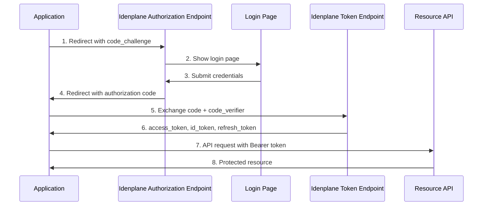
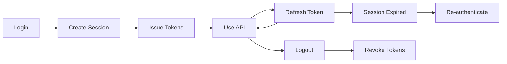

# Authentication Guide

Idenplane implements OAuth 2.0 and OpenID Connect (OIDC) for secure authentication and authorization. This guide covers all supported flows, security considerations, and implementation patterns.

## Supported Flows

Idenplane supports the following OAuth 2.0 flows:

| Flow | Use Case | Security Level |
|------|----------|----------------|
| [Authorization Code + PKCE](#authorization-code-flow) | Web/Mobile apps | Highest |
| [Client Credentials](#client-credentials-grant) | Machine-to-machine | High |
| [Device Authorization](#device-authorization-grant) | CLI tools, Smart TVs | High |
| [Refresh Token](#refreshing-tokens) | Token renewal | High |

:::caution Password Grant Deprecated
The Resource Owner Password Credentials grant is deprecated by OAuth 2.1 and will be removed in a future release. Please migrate to the Authorization Code + PKCE flow.
:::

---

## Authorization Code Flow

The Authorization Code flow is the recommended OAuth 2.0 flow for all applications. It provides the highest security when combined with PKCE (Proof Key for Code Exchange).

### Flow Diagram



### Step 1: Generate PKCE Parameters

Before redirecting the user, generate a code verifier and challenge:

import Tabs from '@theme/Tabs';
import TabItem from '@theme/TabItem';

<Tabs>
<TabItem value="javascript" label="JavaScript">

```javascript
// Generate a random code verifier (43-128 characters)
function generateCodeVerifier() {
  const array = new Uint8Array(32);
  crypto.getRandomValues(array);
  return btoa(String.fromCharCode(...array))
    .replace(/\+/g, '-')
    .replace(/\//g, '_')
    .replace(/=/g, '');
}

// Generate code challenge from verifier using SHA-256
async function generateCodeChallenge(verifier) {
  const encoder = new TextEncoder();
  const data = encoder.encode(verifier);
  const digest = await crypto.subtle.digest('SHA-256', data);
  return btoa(String.fromCharCode(...new Uint8Array(digest)))
    .replace(/\+/g, '-')
    .replace(/\//g, '_')
    .replace(/=/g, '');
}

// Usage
const codeVerifier = generateCodeVerifier();
const codeChallenge = await generateCodeChallenge(codeVerifier);

// Store verifier securely (sessionStorage is recommended)
sessionStorage.setItem('code_verifier', codeVerifier);
```

</TabItem>
<TabItem value="python" label="Python">

```python
import secrets
import hashlib
import base64

def generate_code_verifier(length=64):
    """Generate a random code verifier."""
    return secrets.token_urlsafe(length)[:128]

def generate_code_challenge(verifier):
    """Generate code challenge from verifier using SHA-256."""
    digest = hashlib.sha256(verifier.encode()).digest()
    return base64.urlsafe_b64encode(digest).decode().rstrip('=')

# Usage
code_verifier = generate_code_verifier()
code_challenge = generate_code_challenge(code_verifier)
```

</TabItem>
<TabItem value="kotlin" label="Kotlin">

```kotlin
import java.security.SecureRandom
import java.util.Base64
import java.security.MessageDigest

fun generateCodeVerifier(): String {
    val random = SecureRandom()
    val bytes = ByteArray(32)
    random.nextBytes(bytes)
    return Base64.getUrlEncoder().withoutPadding().encodeToString(bytes)
}

fun generateCodeChallenge(verifier: String): String {
    val digest = MessageDigest.getInstance("SHA-256")
    val hash = digest.digest(verifier.toByteArray())
    return Base64.getUrlEncoder().withoutPadding().encodeToString(hash)
}
```

</TabItem>
</Tabs>

### Step 2: Redirect to Authorization Endpoint

Construct the authorization URL and redirect the user:

```javascript
const authUrl = new URL(
  'http://localhost:3000/realms/my-realm/protocol/openid-connect/auth'
);

authUrl.searchParams.set('client_id', 'my-app');
authUrl.searchParams.set('redirect_uri', 'https://myapp.com/callback');
authUrl.searchParams.set('response_type', 'code');
authUrl.searchParams.set('scope', 'openid profile email');
authUrl.searchParams.set('state', generateRandomState());
authUrl.searchParams.set('code_challenge', codeChallenge);
authUrl.searchParams.set('code_challenge_method', 'S256');

// Optional parameters
authUrl.searchParams.set('nonce', generateRandomNonce());
authUrl.searchParams.set('acr_values', 'urn:idenplane:acr:mfa');
authUrl.searchParams.set('login_hint', 'user@example.com');

// Redirect user
window.location.href = authUrl.toString();
```

### Authorization Parameters

| Parameter | Required | Description |
|-----------|----------|-------------|
| `client_id` | Yes | Your application's client ID |
| `redirect_uri` | Yes | URL to redirect after authorization |
| `response_type` | Yes | Must be `code` for authorization code flow |
| `scope` | Yes | Space-separated scopes (include `openid`) |
| `state` | Recommended | Random string to prevent CSRF attacks |
| `code_challenge` | Yes | PKCE challenge (SHA-256 hash of verifier) |
| `code_challenge_method` | Yes | Must be `S256` |
| `nonce` | Recommended | Random string included in ID token |
| `acr_values` | No | Requested Authentication Context Class Reference |
| `login_hint` | No | Pre-fill username field |
| `prompt` | No | `login`, `consent`, `select_account`, or `none` |

### Step 3: Handle the Callback

After authorization, Idenplane redirects to your `redirect_uri` with an authorization code:

```javascript
// Extract code and state from URL
const params = new URLSearchParams(window.location.search);
const code = params.get('code');
const state = params.get('state');
const error = params.get('error');

// Validate state to prevent CSRF
const storedState = sessionStorage.getItem('oauth_state');
if (state !== storedState) {
  throw new Error('State mismatch - potential CSRF attack');
}

// Exchange code for tokens
if (code) {
  const tokenResponse = await exchangeCodeForTokens(code);
  // Store tokens and clean up
  sessionStorage.removeItem('code_verifier');
  sessionStorage.removeItem('oauth_state');
}
```

### Step 4: Exchange Code for Tokens

Send the authorization code to the token endpoint:

```bash
curl -X POST "http://localhost:3000/realms/my-realm/protocol/openid-connect/token" \
  -H "Content-Type: application/x-www-form-urlencoded" \
  -d "grant_type=authorization_code" \
  -d "client_id=my-app" \
  -d "code=eyJhbGciOiJSUzI1NiIsInR5cCI6IkpXVCJ9..." \
  -d "redirect_uri=https://myapp.com/callback" \
  -d "code_verifier=dBjftJeZ4CVP-mB92K27uhbUJU1p1r_wW1gFWFOEjXk"
```

**Response:**

```json
{
  "access_token": "eyJhbGciOiJSUzI1NiIsInR5cCI6IkpXVCJ9...",
  "expires_in": 300,
  "refresh_token": "rt_8xq2k3j5h7...",
  "token_type": "Bearer",
  "id_token": "eyJhbGciOiJSUzI1NiIsInR5cCI6IkpXVCJ9...",
  "scope": "openid profile email"
}
```

### Complete Authorization Code Example

```typescript
import { AuthmeClient, TokenResponse } from 'idenplane-sdk';

class AuthService {
  private client: AuthmeClient;

  constructor() {
    this.client = new AuthmeClient({
      url: 'http://localhost:3000',
      realm: 'my-realm',
      clientId: 'my-app',
      redirectUri: 'https://myapp.com/callback',
    });
  }

  async login(): Promise<void> {
    // Generate PKCE parameters
    const codeVerifier = this.client.generateCodeVerifier();
    const codeChallenge = await this.client.generateCodeChallenge(codeVerifier);

    // Generate state for CSRF protection
    const state = this.generateRandomString(32);

    // Store for callback verification
    sessionStorage.setItem('code_verifier', codeVerifier);
    sessionStorage.setItem('oauth_state', state);

    // Build authorization URL
    const authUrl = new URL(
      `${this.client.config.url}/realms/${this.client.config.realm}/protocol/openid-connect/auth`
    );
    authUrl.searchParams.set('client_id', this.client.config.clientId);
    authUrl.searchParams.set('redirect_uri', this.client.config.redirectUri);
    authUrl.searchParams.set('response_type', 'code');
    authUrl.searchParams.set('scope', 'openid profile email');
    authUrl.searchParams.set('state', state);
    authUrl.searchParams.set('code_challenge', codeChallenge);
    authUrl.searchParams.set('code_challenge_method', 'S256');

    // Redirect
    window.location.href = authUrl.toString();
  }

  async handleCallback(): Promise<TokenResponse | null> {
    const params = new URLSearchParams(window.location.search);
    const code = params.get('code');
    const state = params.get('state');
    const error = params.get('error');

    if (error) {
      throw new Error(`OAuth error: ${error}`);
    }

    if (!code) {
      return null;
    }

    // Verify state
    const storedState = sessionStorage.getItem('oauth_state');
    if (state !== storedState) {
      throw new Error('State mismatch');
    }

    // Exchange code for tokens
    const codeVerifier = sessionStorage.getItem('code_verifier');
    const tokens = await this.client.exchangeCode(code, codeVerifier!);

    // Clean up
    sessionStorage.removeItem('code_verifier');
    sessionStorage.removeItem('oauth_state');

    return tokens;
  }

  private generateRandomString(length: number): string {
    const array = new Uint8Array(length);
    crypto.getRandomValues(array);
    return Array.from(array, (byte) => byte.toString(16).padStart(2, '0')).join('');
  }
}
```

---

## Client Credentials Grant

The Client Credentials grant is used for machine-to-machine communication where there is no user interaction. Service accounts use this flow to obtain access tokens.

### When to Use

- Backend services calling other backend services
- CI/CD pipelines and automation scripts
- Microservices communicating with each other
- CLI tools with service accounts

### Request

```bash
curl -X POST "http://localhost:3000/realms/my-realm/protocol/openid-connect/token" \
  -H "Content-Type: application/x-www-form-urlencoded" \
  -d "grant_type=client_credentials" \
  -d "client_id=my-service" \
  -d "client_secret=${CLIENT_SECRET}" \
  -d "scope=read write"
```

**Response:**

```json
{
  "access_token": "eyJhbGciOiJSUzI1NiIsInR5cCI6IkpXVCJ9...",
  "expires_in": 300,
  "token_type": "Bearer",
  "scope": "read write"
}
```

### Service Account Setup

1. Create a client in Idenplane Admin Console
2. Set the **Access Type** to `Confidential` (service accounts)
3. Configure the allowed grant types (ensure `client_credentials` is enabled)
4. Assign roles to the service account user

```typescript
// Service account token example
async function getServiceToken(): Promise<string> {
  const response = await fetch(
    'http://localhost:3000/realms/my-realm/protocol/openid-connect/token',
    {
      method: 'POST',
      headers: {
        'Content-Type': 'application/x-www-form-urlencoded',
      },
      body: new URLSearchParams({
        grant_type: 'client_credentials',
        client_id: process.env.IDENPLANE_CLIENT_ID,
        client_secret: process.env.IDENPLANE_CLIENT_SECRET,
        scope: 'read write',
      }),
    }
  );

  const { access_token } = await response.json();
  return access_token;
}

// Use token for API calls
async function callProtectedAPI(token: string) {
  const response = await fetch('http://localhost:3000/admin/users', {
    headers: {
      Authorization: `Bearer ${token}`,
    },
  });
  return response.json();
}
```

---

## Device Authorization Grant

The Device Authorization grant (RFC 8628) is designed for devices with limited input capabilities, such as CLI tools, smart TVs, or IoT devices.

### Flow Overview

1. Device requests authorization from Idenplane
2. User enters user code on another device
3. Device polls for authorization completion
4. Device receives tokens

### Step 1: Request Device Code

```bash
curl -X POST "http://localhost:3000/realms/my-realm/protocol/openid-connect/device/code" \
  -d "client_id=my-cli-tool"
```

**Response:**

```json
{
  "device_code": "GmRhmhcxhwAzkoEqiMEg_DnyEysNkuNhszIySk9eS...",
  "user_code": "WDJB-MJHT",
  "verification_uri": "https://idenplane.dev/device",
  "verification_uri_complete": "https://idenplane.dev/device?user_code=WDJB-MJHT",
  "expires_in": 600,
  "interval": 5
}
```

### Step 2: Display Instructions to User

Show the user the verification URI and user code:

```typescript
function displayDeviceAuthorization(deviceResponse: DeviceCodeResponse) {
  console.log(`
  To authorize this device:
  1. Visit: ${deviceResponse.verification_uri_complete}
  2. Enter code: ${deviceResponse.user_code}

  This code expires in ${deviceResponse.expires_in / 60} minutes.
  `);
}
```

### Step 3: Poll for Authorization

```typescript
async function pollForAuthorization(
  deviceCode: string,
  interval: number
): Promise<TokenResponse> {
  while (true) {
    await sleep(interval * 1000);

    const response = await fetch(
      'http://localhost:3000/realms/my-realm/protocol/openid-connect/token',
      {
        method: 'POST',
        headers: {
          'Content-Type': 'application/x-www-form-urlencoded',
        },
        body: new URLSearchParams({
          grant_type: 'urn:ietf:params:oauth:grant-type:device_code',
          client_id: 'my-cli-tool',
          device_code: deviceCode,
        }),
      }
    );

    const data = await response.json();

    switch (data.error) {
      case 'authorization_pending':
        // User hasn't completed authorization yet
        continue;

      case 'slow_down':
        // Increase polling interval
        interval += 5;
        continue;

      case 'access_denied':
        throw new Error('Authorization was denied');

      case 'expired_token':
        throw new Error('Device code expired');

      default:
        // Success or other error
        return data;
    }
  }
}

function sleep(ms: number): Promise<void> {
  return new Promise((resolve) => setTimeout(resolve, ms));
}
```

:::note Device Code Limitations
The device authorization grant does not support MFA or step-up authentication. For applications requiring higher assurance, use the Authorization Code flow.
:::

---

## Refreshing Tokens

Access tokens expire after the configured lifespan (default: 5 minutes). Use refresh tokens to obtain new access tokens without re-authentication.

### Refresh Token Request

```bash
curl -X POST "http://localhost:3000/realms/my-realm/protocol/openid-connect/token" \
  -H "Content-Type: application/x-www-form-urlencoded" \
  -d "grant_type=refresh_token" \
  -d "client_id=my-app" \
  -d "refresh_token=rt_8xq2k3j5h7..."
```

**Response:**

```json
{
  "access_token": "eyJhbGciOiJSUzI1NiIsInR5cCI6IkpXVCJ9...",
  "expires_in": 300,
  "refresh_token": "rt_new_8xq2k3j5h7...",  // New refresh token (token rotation)
  "token_type": "Bearer",
  "scope": "openid profile email"
}
```

### Token Rotation

Idenplane uses refresh token rotation by default. Each refresh token can only be used once, and a new refresh token is issued with each refresh. This provides enhanced security by detecting token theft through reuse attempts.

```typescript
class TokenManager {
  private refreshToken: string | null = null;
  private client: AuthmeClient;

  async refreshAccessToken(): Promise<void> {
    if (!this.refreshToken) {
      throw new Error('No refresh token available');
    }

    try {
      const response = await fetch(
        `${this.client.config.url}/realms/${this.client.config.realm}/protocol/openid-connect/token`,
        {
          method: 'POST',
          headers: {
            'Content-Type': 'application/x-www-form-urlencoded',
          },
          body: new URLSearchParams({
            grant_type: 'refresh_token',
            client_id: this.client.config.clientId,
            refresh_token: this.refreshToken,
          }),
        }
      );

      if (!response.ok) {
        throw new Error('Token refresh failed');
      }

      const tokens = await response.json();

      // Update stored refresh token (new rotation)
      this.refreshToken = tokens.refresh_token;
      this.storeTokens(tokens);

    } catch (error) {
      // Refresh token compromised or expired
      this.clearTokens();
      throw error;
    }
  }

  private storeTokens(tokens: TokenResponse) {
    // Store tokens securely
    sessionStorage.setItem('access_token', tokens.access_token);
    if (tokens.refresh_token) {
      sessionStorage.setItem('refresh_token', tokens.refresh_token);
    }
  }

  private clearTokens() {
    sessionStorage.removeItem('access_token');
    sessionStorage.removeItem('refresh_token');
  }
}
```

---

## Step-Up Authentication

Step-up authentication allows requesting a higher assurance level for sensitive operations. Idenplane supports ACR (Authentication Context Class Reference) values to indicate the required authentication strength.

### ACR Values

| ACR Value | Description | Use Case |
|-----------|-------------|----------|
| `urn:idenplane:acr:password` | Password authentication only | Standard login |
| `urn:idenplane:acr:mfa` | Multi-factor authentication | Sensitive operations |

### Requesting Step-Up

```typescript
// Request step-up authentication during authorization
const authUrl = new URL(
  'http://localhost:3000/realms/my-realm/protocol/openid-connect/auth'
);

authUrl.searchParams.set('client_id', 'my-app');
authUrl.searchParams.set('redirect_uri', 'https://myapp.com/callback');
authUrl.searchParams.set('response_type', 'code');
authUrl.searchParams.set('scope', 'openid profile email');
authUrl.searchParams.set('acr_values', 'urn:idenplane:acr:mfa');

// User will be prompted for MFA if not already authenticated with MFA
```

### ID Token ACR Claim

After step-up authentication, the ID token includes the ACR claim:

```json
{
  "iss": "http://localhost:3000/realms/my-realm",
  "sub": "user-uuid-123",
  "aud": "my-app",
  "acr": "urn:idenplane:acr:mfa",
  "amr": ["pwd", "otp"],
  "exp": 1620000000
}
```

### Verifying Step-Up in API

```typescript
import jwt from 'jsonwebtoken';

async function verifyAccessTokenWithStepUp(
  token: string,
  requiredAcr: string
): Promise<boolean> {
  // Decode without verification to get claims
  const claims = jwt.decode(token, { complete: true });

  if (!claims || !claims.payload) {
    return false;
  }

  // Get ACR strength comparison
  const tokenAcrStrength = getAcrStrength(claims.payload.acr);
  const requiredAcrStrength = getAcrStrength(requiredAcr);

  return tokenAcrStrength >= requiredAcrStrength;
}

function getAcrStrength(acr: string): number {
  const strengths: Record<string, number> = {
    'urn:idenplane:acr:password': 1,
    'urn:idenplane:acr:mfa': 2,
  };
  return strengths[acr] || 0;
}
```

---

## Session Management

Idenplane manages sessions to track user authentication state and enforce concurrent session limits.

### Session Lifecycle



### Concurrent Session Limits

Realms can enforce maximum concurrent sessions per user:

| Setting | Behavior |
|---------|----------|
| `maxSessionsPerUser: 0` | Unlimited sessions |
| `maxSessionsPerUser: 5` | Maximum 5 active sessions |

When a user exceeds the limit, the oldest sessions are automatically evicted (FIFO).

### Session Cookies

Idenplane uses an `IDENPLANE_SESSION` cookie for browser-based SSO:

```typescript
// Cookie configuration (set by Idenplane server)
const cookieConfig = {
  name: 'IDENPLANE_SESSION',
  httpOnly: true,      // Not accessible by JavaScript
  secure: true,        // HTTPS only in production
  sameSite: 'strict',   // CSRF protection
  path: '/',
  maxAge: 86400000,    // 24 hours
};
```

### Logout

```bash
# Logout endpoint
curl -X GET "http://localhost:3000/realms/my-realm/protocol/openid-connect/logout" \
  -H "Authorization: Bearer ${ACCESS_TOKEN}"
```

```typescript
async function logout(accessToken: string, refreshToken: string) {
  // Revoke refresh token
  await fetch(
    'http://localhost:3000/realms/my-realm/protocol/openid-connect/token/revoke',
    {
      method: 'POST',
      body: new URLSearchParams({ token: refreshToken }),
    }
  );

  // Clear local storage
  sessionStorage.clear();
  localStorage.removeItem('idenplane_tokens');
}
```

---

## Security Best Practices

### Always Use PKCE

:::warning PKCE Required for Public Clients
OAuth 2.1 requires PKCE for all authorization code flows. Idenplane enforces this for public clients.
:::

### Protect Against CSRF

```typescript
// Generate and store state for CSRF protection
function generateState(): string {
  const array = new Uint8Array(32);
  crypto.getRandomValues(array);
  return btoa(String.fromCharCode(...array))
    .replace(/\+/g, '-')
    .replace(/\//g, '_')
    .replace(/=/g, '');
}

const state = generateState();
sessionStorage.setItem('oauth_state', state);

// On callback, verify state matches
const returnedState = new URLSearchParams(window.location.search).get('state');
if (returnedState !== sessionStorage.getItem('oauth_state')) {
  throw new Error('CSRF attack detected');
}
```

### Use Secure Token Storage

| Storage | Use Case | Security |
|--------|----------|----------|
| `memory` | Single-page apps, short-lived | Best (cleared on page close) |
| `sessionStorage` | Multi-tab browsing | Good (isolated per tab) |
| `localStorage` | Persistent sessions | Caution (accessible to JS) |
| `HttpOnly cookies` | Server-side apps | Best (not accessible to JS) |

### Validate Redirect URIs

Configure exact redirect URIs in your client configuration:

```json
{
  "redirectUris": [
    "https://myapp.com/callback",
    "https://staging.myapp.com/callback"
  ]
}
```

### Token Expiration

| Token Type | Default Lifespan | Recommended |
|------------|------------------|-------------|
| Access Token | 5 minutes | 5-15 minutes |
| Refresh Token | 30 minutes | 30-60 minutes |
| ID Token | 5 minutes | Match access token |

---

## Error Handling

### OAuth Error Responses

```typescript
interface OAuthError {
  error: string;           // Error code
  error_description?: string;  // Human-readable description
  error_uri?: string;      // Link to documentation
}

async function handleTokenRequest() {
  try {
    const response = await fetch(tokenUrl, options);
    const data = await response.json();

    if (!response.ok && data.error) {
      switch (data.error) {
        case 'invalid_grant':
          // Authorization code expired or already used
          // Clear stored code and re-initiate flow
          break;

        case 'invalid_client':
          // Client authentication failed
          // Check client_id and client_secret
          break;

        case 'invalid_request':
          // Malformed request
          // Check request parameters
          break;

        case 'unauthorized_client':
          // Grant type not allowed for client
          break;

        case 'unsupported_grant_type':
          // Server doesn't support this grant type
          break;
      }

      throw new OAuthError(data);
    }

    return data;
  } catch (error) {
    // Handle network errors
    if (error instanceof TypeError) {
      throw new Error('Network error - check connection');
    }
    throw error;
  }
}
```

### Error Flow Detection

```typescript
// Detect and handle error responses from authorization
function parseCallback(): { code?: string; error?: string; state?: string } {
  const params = new URLSearchParams(window.location.search);
  const code = params.get('code');
  const error = params.get('error');
  const errorDescription = params.get('error_description');
  const state = params.get('state');

  if (error) {
    const errorMessages: Record<string, string> = {
      'access_denied': 'User denied the authorization request',
      'invalid_request': 'Invalid authorization request parameters',
      'unauthorized_client': 'This client is not authorized',
      'unsupported_response_type': 'Server does not support this response type',
      'server_error': 'Authorization server encountered an error',
    };

    throw new Error(
      errorMessages[error] || `Authorization error: ${errorDescription}`
    );
  }

  return { code, state };
}
```

---

## Next Steps

<div style={{display: 'grid', gridTemplateColumns: 'repeat(2, 1fr)', gap: '1rem', marginTop: '2rem'}}>

[**Authorization Guide**](/docs/guides/authorization)
Learn about RBAC, permissions, and access control policies

[**MFA Setup**](/docs/guides/mfa)
Configure multi-factor authentication for your users

[**API Reference**](/docs/api)
Complete REST API documentation with examples

[**React SDK**](/docs/guides/sdks/react)
Integrate Idenplane into your React application

</div>

---

<p align="center">
  <a href="https://idenplane.dev">idenplane.dev</a> &middot;
  <a href="https://github.com/Islamawad132/Authme">GitHub</a> &middot;
  <a href="https://discord.gg/idenplane">Discord</a>
</p>
