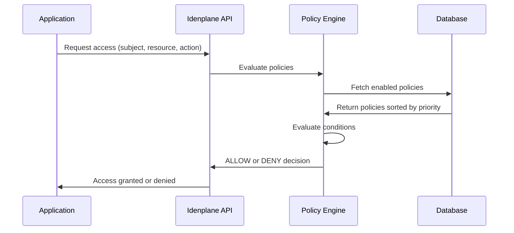
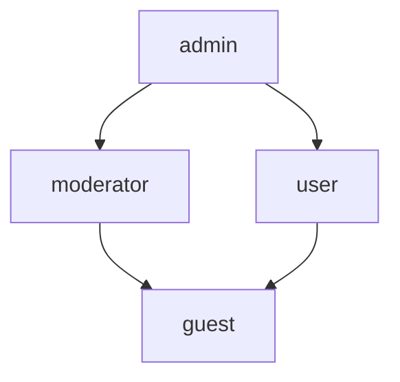

# Authorization Guide

Idenplane provides a flexible authorization system based on Attribute-Based Access Control (ABAC) policies. This guide covers role-based access control (RBAC), policy creation, condition types, and policy evaluation.

## Overview

Idenplane's authorization system combines RBAC with ABAC for fine-grained access control:

| Approach | Description | Use Case |
|----------|-------------|----------|
| **RBAC** | Role-based permissions assigned to users | Basic access control |
| **ABAC Policies** | Attribute-based rules with conditions | Complex, dynamic access decisions |

### Authorization Flow



### DENY-Override Algorithm

Idenplane uses a DENY-override algorithm:

1. All enabled policies are sorted by priority (highest first)
2. Each policy is evaluated against the request
3. If any DENY policy matches → final decision is DENY
4. If at least one ALLOW policy matches → final decision is ALLOW
5. If no policy matches → default DENY

:::caution Default Deny
Idenplane defaults to DENY when no policy matches. This ensures secure access control by default.
:::

---

## Roles and Permissions

Roles are the foundation of RBAC in Idenplane. Users can be assigned multiple roles, and roles can have hierarchical relationships.

### Role Hierarchy

Roles can inherit permissions from other roles:



### Assigning Roles to Users

```bash
# Assign role to user via Admin API
curl -X POST "http://localhost:3000/admin/realms/my-realm/users/user-123/roles" \
  -H "Authorization: Bearer ${ADMIN_TOKEN}" \
  -H "Content-Type: application/json" \
  -d '["admin", "moderator"]'
```

### Role-Based Permissions

| Role | Permissions |
|------|-------------|
| `admin` | Full access to all resources |
| `moderator` | Manage content, view reports |
| `user` | Read/write own resources |
| `guest` | Read-only public resources |

---

## ABAC Policies

ABAC policies in Idenplane are defined as JSON documents with conditions on four categories:

### Policy Structure

```json
{
  "id": "policy-uuid-123",
  "name": "allow-admins-to-read-reports",
  "description": "Allows admin-role users to read report resources",
  "enabled": true,
  "effect": "ALLOW",
  "priority": 10,
  "logic": "AND",
  "clientId": null,
  "subjectConditions": [
    { "field": "subject.roles", "operator": "contains", "value": "admin" }
  ],
  "resourceConditions": [
    { "field": "resource.type", "operator": "equals", "value": "report" }
  ],
  "actionConditions": [
    { "field": "action", "operator": "in", "value": ["read", "list"] }
  ]
}
```

### Policy Fields

| Field | Type | Required | Description |
|-------|------|----------|-------------|
| `name` | string | Yes | Unique policy name within realm |
| `description` | string | No | Human-readable description |
| `enabled` | boolean | No | Whether policy is active (default: true) |
| `effect` | string | No | "ALLOW" or "DENY" (default: "ALLOW") |
| `priority` | integer | No | Higher = evaluated first (default: 0) |
| `logic` | string | No | "AND" or "OR" for conditions (default: "AND") |
| `clientId` | string | No | Scope policy to specific client |
| `subjectConditions` | array | No | Conditions on the subject (user) |
| `resourceConditions` | array | No | Conditions on the resource |
| `actionConditions` | array | No | Conditions on the action |
| `environmentConditions` | array | No | Conditions on environment (IP, time) |

---

## Condition Operators

Idenplane supports the following condition operators:

### Comparison Operators

| Operator | Description | Example |
|----------|-------------|---------|
| `equals` | Exact match | `"field": "value"` |
| `notEquals` | Not equal | `"field": "other"` |
| `contains` | String/array contains | `["admin"]` in roles |
| `in` | Value in array | `["read", "write"]` |
| `notIn` | Value not in array | not in `["delete"]` |

### Numeric Operators

| Operator | Description | Example |
|----------|-------------|---------|
| `greaterThan` | Numeric comparison | `priority > 5` |
| `lessThan` | Numeric comparison | `count < 100` |

### Pattern Operators

| Operator | Description | Example |
|----------|-------------|---------|
| `matches` | Regex match | `email matches .*@company.com` |
| `ipInRange` | CIDR range check | `ip in 10.0.0.0/8` |

### Condition Field Paths

Conditions use dot-notation paths:

| Path | Description | Example Value |
|------|-------------|---------------|
| `subject.userId` | User ID | `"user-uuid-123"` |
| `subject.roles` | User roles array | `["admin", "user"]` |
| `subject.groups` | User groups array | `["engineering"]` |
| `subject.attributes` | Custom attributes | `{ "department": "eng" }` |
| `resource.type` | Resource type | `"report"` |
| `resource.id` | Resource ID | `"resource-uuid"` |
| `resource.ownerId` | Resource owner | `"user-uuid-123"` |
| `resource.attributes` | Resource attributes | `{ "classification": "secret" }` |
| `action` | Action name | `"read"` |
| `environment.ip` | Client IP address | `"192.168.1.1"` |
| `environment.time` | Request timestamp | `"2026-03-24T10:00:00Z"` |

---

## Creating Policies

### Create Policy via API

```bash
curl -X POST "http://localhost:3000/admin/realms/my-realm/policies" \
  -H "Authorization: Bearer ${ADMIN_TOKEN}" \
  -H "Content-Type: application/json" \
  -d '{
    "name": "allow-admins-all-access",
    "description": "Allows admin users full access",
    "effect": "ALLOW",
    "priority": 100,
    "subjectConditions": [
      { "field": "subject.roles", "operator": "contains", "value": "admin" }
    ]
  }'
```

**Response:**

```json
{
  "id": "policy-uuid-new-123",
  "name": "allow-admins-all-access",
  "description": "Allows admin users full access",
  "enabled": true,
  "effect": "ALLOW",
  "priority": 100,
  "logic": "AND",
  "clientId": null,
  "subjectConditions": [
    { "field": "subject.roles", "operator": "contains", "value": "admin" }
  ],
  "resourceConditions": null,
  "actionConditions": null,
  "environmentConditions": null,
  "createdAt": "2026-05-10T12:00:00.000Z",
  "updatedAt": "2026-05-10T12:00:00.000Z"
}
```

### Policy Examples

#### Allow Admins Read Access

```json
{
  "name": "admins-read-access",
  "description": "Allow admins to read all resources",
  "effect": "ALLOW",
  "subjectConditions": [
    { "field": "subject.roles", "operator": "contains", "value": "admin" }
  ],
  "actionConditions": [
    { "field": "action", "operator": "in", "value": ["read", "list"] }
  ]
}
```

#### Deny Guest Access to Confidential Resources

```json
{
  "name": "deny-guests-confidential",
  "description": "Deny guest users access to confidential resources",
  "effect": "DENY",
  "priority": 200,
  "subjectConditions": [
    { "field": "subject.roles", "operator": "contains", "value": "guest" }
  ],
  "resourceConditions": [
    { "field": "resource.attributes.classification", "operator": "equals", "value": "confidential" }
  ]
}
```

#### IP Range Restriction

```json
{
  "name": "internal-network-only",
  "description": "Allow access only from internal network",
  "effect": "ALLOW",
  "environmentConditions": [
    { "field": "environment.ip", "operator": "ipInRange", "value": "10.0.0.0/8" },
    { "field": "environment.ip", "operator": "ipInRange", "value": "172.16.0.0/12" },
    { "field": "environment.ip", "operator": "ipInRange", "value": "192.168.0.0/16" }
  ]
}
```

#### Owner-Only Access

```json
{
  "name": "owner-access-only",
  "description": "Allow resource owners full access",
  "effect": "ALLOW",
  "resourceConditions": [
    { "field": "resource.ownerId", "operator": "equals", "value": "" }
  ],
  "actionConditions": [
    { "field": "action", "operator": "in", "value": ["read", "write", "delete"] }
  ]
}
```

:::note Missing Subject ID
When creating a policy for owner-only access, leave `subject.userId` conditions empty and use the evaluation context to dynamically match the owner.
:::

#### Group-Based Access

```json
{
  "name": "engineering-access",
  "description": "Allow engineering group access to engineering resources",
  "effect": "ALLOW",
  "subjectConditions": [
    { "field": "subject.groups", "operator": "contains", "value": "engineering" }
  ],
  "resourceConditions": [
    { "field": "resource.attributes.department", "operator": "equals", "value": "engineering" }
  ]
}
```

---

## Evaluating Policies

### Evaluate All Policies

```bash
curl -X POST "http://localhost:3000/admin/realms/my-realm/policies/evaluate" \
  -H "Authorization: Bearer ${ADMIN_TOKEN}" \
  -H "Content-Type: application/json" \
  -d '{
    "subject": {
      "userId": "user-uuid-123",
      "roles": ["admin", "user"],
      "groups": ["engineering"],
      "attributes": { "department": "engineering" }
    },
    "resource": {
      "type": "report",
      "id": "report-uuid-456",
      "attributes": { "classification": "internal" }
    },
    "action": "read",
    "environment": {
      "ip": "10.1.2.3"
    }
  }'
```

**Response:**

```json
{
  "decision": "ALLOW",
  "reason": "Permitted by policy \"admins-read-access\"",
  "matchedPolicies": [
    {
      "policyId": "policy-uuid-1",
      "policyName": "admins-read-access",
      "effect": "ALLOW",
      "matched": true,
      "conditionResults": [
        { "conditionType": "subject", "passed": true, "reason": "\"subject.roles\" contains \"admin\"" },
        { "conditionType": "action", "passed": true, "reason": "\"action\" is in [read, list]" }
      ]
    }
  ],
  "evaluatedCount": 5
}
```

### Deny Decision Example

```json
{
  "decision": "DENY",
  "reason": "Explicit DENY by policy \"deny-guests-confidential\"",
  "matchedPolicies": [
    {
      "policyId": "policy-uuid-2",
      "policyName": "deny-guests-confidential",
      "effect": "DENY",
      "matched": true,
      "conditionResults": [
        { "conditionType": "subject", "passed": true, "reason": "\"subject.roles\" contains \"guest\"" },
        { "conditionType": "resource", "passed": true, "reason": "\"resource.attributes.classification\" equals \"confidential\"" }
      ]
    }
  ],
  "evaluatedCount": 5
}
```

### Default Deny Example

```json
{
  "decision": "DENY",
  "reason": "No matching policy — default deny",
  "matchedPolicies": [],
  "evaluatedCount": 5
}
```

---

## Testing Policies

### Test Single Policy

```bash
curl -X POST "http://localhost:3000/admin/realms/my-realm/policies/policy-uuid-123/test" \
  -H "Authorization: Bearer ${ADMIN_TOKEN}" \
  -H "Content-Type: application/json" \
  -d '{
    "subject": {
      "userId": "user-uuid-123",
      "roles": ["admin"],
      "groups": ["engineering"]
    },
    "resource": {
      "type": "report",
      "id": "report-uuid-456"
    },
    "action": "read"
  }'
```

**Response:**

```json
{
  "matched": true,
  "effect": "ALLOW",
  "detail": {
    "policyId": "policy-uuid-123",
    "policyName": "allow-admins-all-access",
    "effect": "ALLOW",
    "matched": true,
    "conditionResults": [
      { "conditionType": "subject", "passed": true, "reason": "\"subject.roles\" contains \"admin\"" }
    ]
  }
}
```

---

## Client-Scoped Policies

Policies can be scoped to specific OAuth clients:

```json
{
  "name": "frontend-user-access",
  "description": "User access for frontend application",
  "effect": "ALLOW",
  "clientId": "my-frontend-app",
  "subjectConditions": [
    { "field": "subject.roles", "operator": "contains", "value": "user" }
  ]
}
```

### Evaluate with Client Scope

```bash
curl -X POST "http://localhost:3000/admin/realms/my-realm/policies/evaluate" \
  -H "Authorization: Bearer ${ADMIN_TOKEN}" \
  -H "Content-Type: application/json" \
  -d '{
    "subject": { "roles": ["user"] },
    "resource": { "type": "document" },
    "action": "read",
    "clientId": "my-frontend-app"
  }'
```

When `clientId` is specified in the evaluation request, only policies that are either:
- Globally scoped (`clientId: null`)
- Scoped to the specific client

...will be evaluated.

---

## Policy Priority

Higher priority policies are evaluated first. Use priorities to control evaluation order:

| Priority | Use Case |
|----------|----------|
| 100+ | Critical policies (Deny overrides) |
| 50-99 | High-priority policies |
| 0-49 | Normal policies |
| Negative | Low-priority catch-all policies |

### Priority Example

```json
{
  "name": "emergency-lockdown",
  "description": "Block all access in emergency",
  "effect": "DENY",
  "priority": 1000
}
```

:::warning Priority Conflicts
Two DENY policies at the same priority level: the first one to match wins. Always use distinct priorities for critical policies.
:::

---

## Managing Policies

### List All Policies

```bash
curl -X GET "http://localhost:3000/admin/realms/my-realm/policies" \
  -H "Authorization: Bearer ${ADMIN_TOKEN}"
```

**Response:**

```json
[
  {
    "id": "policy-uuid-1",
    "name": "allow-admins-all-access",
    "priority": 100,
    "effect": "ALLOW",
    "enabled": true
  },
  {
    "id": "policy-uuid-2",
    "name": "deny-guests-confidential",
    "priority": 50,
    "effect": "DENY",
    "enabled": true
  }
]
```

### Get Single Policy

```bash
curl -X GET "http://localhost:3000/admin/realms/my-realm/policies/policy-uuid-123" \
  -H "Authorization: Bearer ${ADMIN_TOKEN}"
```

### Update Policy

```bash
curl -X PUT "http://localhost:3000/admin/realms/my-realm/policies/policy-uuid-123" \
  -H "Authorization: Bearer ${ADMIN_TOKEN}" \
  -H "Content-Type: application/json" \
  -d '{
    "description": "Updated description",
    "priority": 75,
    "subjectConditions": [
      { "field": "subject.roles", "operator": "in", "value": ["admin", "super-admin"] }
    ]
  }'
```

### Delete Policy

```bash
curl -X DELETE "http://localhost:3000/admin/realms/my-realm/policies/policy-uuid-123" \
  -H "Authorization: Bearer ${ADMIN_TOKEN}"
```

### Disable Policy

```bash
curl -X PUT "http://localhost:3000/admin/realms/my-realm/policies/policy-uuid-123" \
  -H "Authorization: Bearer ${ADMIN_TOKEN}" \
  -H "Content-Type: application/json" \
  -d '{ "enabled": false }'
```

---

## SDK Integration

### Using the Authorization Service

import Tabs from '@theme/Tabs';
import TabItem from '@theme/TabItem';

<Tabs>
<TabItem value="typescript" label="TypeScript">

```typescript
import { IdenplaneClient, PolicyEvaluationResult } from 'idenplane-sdk';

const client = new IdenplaneClient({
  url: 'http://localhost:3000',
  realm: 'my-realm',
  clientId: 'my-app',
});

async function checkAccess(): Promise<boolean> {
  const result: PolicyEvaluationResult = await client.authorization.evaluate({
    subject: {
      userId: 'user-uuid-123',
      roles: ['admin', 'user'],
      groups: ['engineering'],
      attributes: { department: 'engineering' },
    },
    resource: {
      type: 'report',
      id: 'report-uuid-456',
      attributes: { classification: 'internal' },
    },
    action: 'read',
    environment: {
      ip: '10.1.2.3',
    },
  });

  return result.decision === 'ALLOW';
}

async function testPolicy(): Promise<void> {
  const result = await client.authorization.testPolicy(
    'policy-uuid-123',
    {
      subject: { roles: ['admin'] },
      resource: { type: 'report' },
      action: 'read',
    }
  );

  console.log(`Policy matched: ${result.matched}`);
  console.log(`Effect: ${result.effect}`);
  console.log('Condition results:', result.detail.conditionResults);
}
```

</TabItem>
<TabItem value="python" label="Python">

```python
from idenplane import IdenplaneClient

client = IdenplaneClient(
    url='http://localhost:3000',
    realm='my-realm',
    client_id='my-app',
)

async def check_access():
    result = await client.authorization.evaluate({
        'subject': {
            'user_id': 'user-uuid-123',
            'roles': ['admin', 'user'],
            'groups': ['engineering'],
            'attributes': {'department': 'engineering'}
        },
        'resource': {
            'type': 'report',
            'id': 'report-uuid-456',
            'attributes': {'classification': 'internal'}
        },
        'action': 'read',
        'environment': {
            'ip': '10.1.2.3'
        }
    })

    return result['decision'] == 'ALLOW'
```

</TabItem>
<TabItem value="kotlin" label="Kotlin">

```kotlin
import com.idenplane.sdk.IdenplaneClient
import com.idenplane.sdk.authorization.*

val client = IdenplaneClient(
    url = "http://localhost:3000",
    realm = "my-realm",
    clientId = "my-app"
)

suspend fun checkAccess(): Boolean {
    val result = client.authorization.evaluate(
        EvaluationRequest(
            subject = Subject(
                userId = "user-uuid-123",
                roles = listOf("admin", "user"),
                groups = listOf("engineering")
            ),
            resource = Resource(
                type = "report",
                id = "report-uuid-456"
            ),
            action = "read",
            environment = Environment(ip = "10.1.2.3")
        )
    )

    return result.decision == Decision.ALLOW
}
```

</TabItem>
</Tabs>

---

## Best Practices

### Policy Design

1. **Use descriptive names**: Include the purpose in the policy name
   - Good: `allow-admins-manage-users`
   - Bad: `policy-1`

2. **Add descriptions**: Explain the intent of each policy
   ```json
   {
     "name": "deny-guests-confidential",
     "description": "Guests cannot access confidential resources per security policy SEC-2024-01"
   }
   ```

3. **Set appropriate priorities**: Higher priority for more specific policies
   ```json
   {
     "name": "specific-allow",
     "priority": 50,
     "description": "Specific allows should override general allows"
   }
   ```

4. **Group related conditions**: Use AND logic for conditions that must all match
   ```json
   {
     "logic": "AND",
     "subjectConditions": [
       { "field": "subject.roles", "operator": "contains", "value": "admin" }
     ],
     "resourceConditions": [
       { "field": "resource.type", "operator": "equals", "value": "admin-panel" }
     ]
   }
   ```

### Security Considerations

:::warning DENY-Override Priority
Always set DENY policies with higher priority than ALLOW policies to ensure explicit denials take precedence.
:::

### Testing Policies

1. **Test before deploying**: Use the test endpoint to verify policy behavior
2. **Test edge cases**: Include cases that should match and should not match
3. **Review condition results**: Check the `reason` field in responses

### Performance

1. **Cache evaluations**: Policy lists are cached for 60 seconds
2. **Optimize conditions**: Avoid complex regex patterns in hot paths
3. **Disable unused policies**: Set `enabled: false` instead of deleting

---

## Error Handling

### Common Errors

| Error | Cause | Solution |
|-------|-------|----------|
| 400 Bad Request | Invalid condition format | Check condition JSON structure |
| 404 Not Found | Policy ID doesn't exist | Verify policy ID |
| 409 Conflict | Policy name already exists | Use unique names |
| 401 Unauthorized | Invalid admin API key | Check Authorization header |

### Error Response Format

```json
{
  "statusCode": 400,
  "message": "Validation failed",
  "errors": [
    {
      "field": "subjectConditions",
      "message": "Invalid condition operator 'invalid-operator'"
    }
  ]
}
```

---

## Next Steps

<div style={{display: 'grid', gridTemplateColumns: 'repeat(2, 1fr)', gap: '1rem', marginTop: '2rem'}}>

[**Authentication Guide**](/docs/guides/authentication)
Learn about OAuth 2.0 and OpenID Connect flows

[**MFA Setup**](/docs/guides/mfa)
Configure multi-factor authentication

[**API Reference**](/docs/api)
Complete REST API documentation

[**React SDK**](/docs/guides/sdks/react)
Integrate Idenplane into your React application

</div>

---

<p align="center">
  <a href="https://idenplane.dev">idenplane.dev</a> &middot;
  <a href="https://github.com/idenplane/idenplane">GitHub</a> &middot;
  <a href="https://discord.gg/idenplane">Discord</a>
</p>