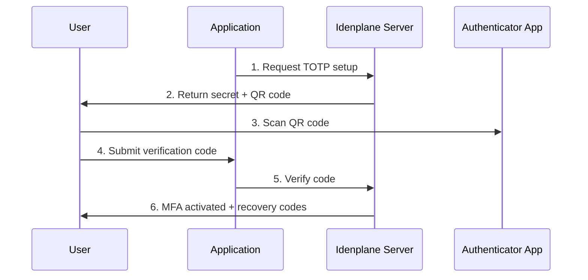
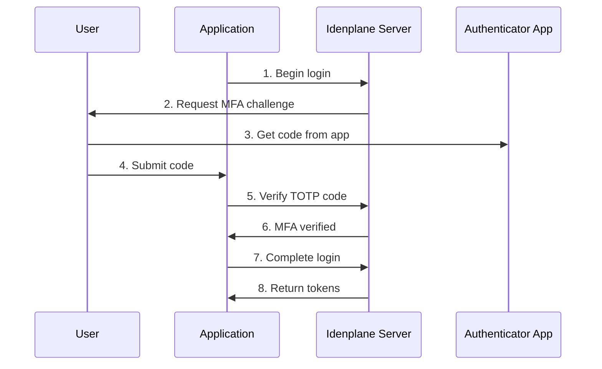

# MFA Guide

Multi-Factor Authentication (MFA) adds an extra layer of security by requiring a second form of verification beyond passwords. Idenplane supports Time-based One-Time Passwords (TOTP) as the second factor, with optional recovery codes for account recovery.

## Supported Methods

Idenplane supports TOTP (RFC 6238) for multi-factor authentication:

| Method | Description | Security Level |
|--------|-------------|----------------|
| [TOTP](#totp-setup) | Time-based 6-digit codes from authenticator apps | High |
| [Recovery Codes](#recovery-codes) | Backup codes for account recovery | Fallback |

:::caution MFA Required for Admins
Realm administrators may require MFA step-up verification for sensitive operations. API key authentication is not permitted for operations that require MFA verification.
:::

---

## TOTP Setup

The TOTP setup flow involves generating a secret, displaying a QR code for easy enrollment, and verifying the first code to activate MFA.

### Setup Flow



### Step 1: Initiate TOTP Setup

Request TOTP setup for a user:

```bash
curl -X POST "http://localhost:3000/realms/my-realm/mfa/setup" \
  -H "Authorization: Bearer ${ACCESS_TOKEN}" \
  -H "Content-Type: application/json"
```

**Response:**

```json
{
  "secret": "JBSWY3DPEHPK3PXP",
  "qrCodeDataUrl": "data:image/png;base64,iVBORw0KGgoAAAANSUhEUg...",
  "otpauthUrl": "otpauth://totp/Idenplane%20(my-realm)/user@example.com?secret=JBSWY3DPEHPK3PXP&issuer=Idenplane%20%28my-realm%29&algorithm=SHA1&digits=6&period=30"
}
```

### Step 2: Display QR Code

Render the QR code for the user to scan:

```tsx
function TOTPSetup({ setupData }) {
  return (
    <div className="mfa-setup">
      <h2>Set Up Authenticator App</h2>
      <p>Scan this QR code with your authenticator app:</p>
      

      <details>
        <summary>Can't scan? Enter manually</summary>
        <div className="manual-entry">
          <label>Secret Key:</label>
          <code>{setupData.secret}</code>
          <p>Open your authenticator app and enter this secret manually.</p>
        </div>
      </details>
    </div>
  );
}
```

### Step 3: Verify and Activate

After the user scans the QR code, verify the first code to activate MFA:

```bash
curl -X POST "http://localhost:3000/realms/my-realm/mfa/verify" \
  -H "Authorization: Bearer ${ACCESS_TOKEN}" \
  -H "Content-Type: application/json" \
  -d '{
    "verificationCode": "123456"
  }'
```

**Response:**

```json
{
  "success": true,
  "recoveryCodes": [
    "A3F2B8C1",
    "7D4E9F2A",
    "B1C3D8E5",
    "2F9A4C7D",
    "E8B3F1A6",
    "5C7D2E9B",
    "D4A8F3C1",
    "9E2B5D8A",
    "F6C1B3E7",
    "1D4E9A2F"
  ]
}
```

:::warning Save Recovery Codes
Store recovery codes securely. They are the only way to recover access if you lose your authenticator device. Each code can only be used once.
:::

---

## TOTP Verification

After MFA is enabled, users must provide a TOTP code during authentication for sensitive operations.

### Verification Flow



### Standard Login with MFA

When MFA is required, the login flow prompts for a verification code:

```typescript
async function loginWithMfa(
  username: string,
  password: string,
  totpCode: string
): Promise<TokenResponse> {
  // Step 1: Initial authentication
  const loginResponse = await fetch(
    'http://localhost:3000/realms/my-realm/protocol/openid-connect/auth',
    {
      method: 'POST',
      headers: { 'Content-Type': 'application/json' },
      body: JSON.stringify({ username, password }),
    }
  );

  if (loginResponse.status === 403) {
    // MFA required - exchange for challenge token
    const { challengeToken } = await loginResponse.json();

    // Step 2: Verify TOTP code
    const verifyResponse = await fetch(
      'http://localhost:3000/realms/my-realm/mfa/verify',
      {
        method: 'POST',
        headers: {
          'Content-Type': 'application/json',
          'X-MFA-Challenge': challengeToken,
        },
        body: JSON.stringify({ code: totpCode }),
      }
    );

    if (!verifyResponse.ok) {
      throw new Error('Invalid MFA code');
    }

    // Step 3: Complete login with verified session
    return completeLoginFlow(challengeToken);
  }

  return loginResponse.json();
}
```

### Verify TOTP Code

Send the TOTP code for verification:

```bash
curl -X POST "http://localhost:3000/realms/my-realm/mfa/verify" \
  -H "Authorization: Bearer ${ACCESS_TOKEN}" \
  -H "X-MFA-Challenge: ${CHALLENGE_TOKEN}" \
  -H "Content-Type: application/json" \
  -d '{
    "code": "123456"
  }'
```

**Response:**

```json
{
  "verified": true,
  "acr": "urn:idenplane:acr:mfa"
}
```

### Error Handling

```typescript
interface MFAVerificationResponse {
  verified?: boolean;
  error?: string;
  error_description?: string;
  remainingAttempts?: number;
}

async function verifyTotpCode(code: string, challengeToken: string) {
  try {
    const response = await fetch(
      'http://localhost:3000/realms/my-realm/mfa/verify',
      {
        method: 'POST',
        headers: {
          'Content-Type': 'application/json',
          'X-MFA-Challenge': challengeToken,
        },
        body: JSON.stringify({ code }),
      }
    );

    const data: MFAVerificationResponse = await response.json();

    if (!response.ok || data.error) {
      switch (data.error) {
        case 'invalid_code':
          const remaining = data.remainingAttempts ?? 0;
          if (remaining <= 2) {
            throw new Error('Warning: Few attempts remaining before lockout');
          }
          throw new Error(`Invalid code. ${remaining} attempts remaining.`);

        case 'challenge_expired':
          throw new Error('Challenge expired. Please restart the login process.');

        case 'max_attempts_exceeded':
          throw new Error('Maximum attempts exceeded. Account temporarily locked.');
      }
    }

    return data;
  } catch (error) {
    if (error instanceof TypeError) {
      throw new Error('Network error - check connection');
    }
    throw error;
  }
}
```

:::note TOTP Window
Idenplane validates TOTP codes with a window of ±1 step (30 seconds). This accommodates clock skew between the server and authenticator app.
:::

---

## Recovery Codes

Recovery codes provide a fallback mechanism when users lose access to their authenticator app. Each code can only be used once.

### Using Recovery Codes

When TOTP is unavailable, users can use a recovery code instead:

```bash
curl -X POST "http://localhost:3000/realms/my-realm/mfa/recovery" \
  -H "Authorization: Bearer ${ACCESS_TOKEN}" \
  -H "X-MFA-Challenge: ${CHALLENGE_TOKEN}" \
  -H "Content-Type: application/json" \
  -d '{
    "recoveryCode": "A3F2B8C1"
  }'
```

**Response:**

```json
{
  "verified": true,
  "remainingCodes": 9
}
```

### Recovery Code Flow

```typescript
async function loginWithRecoveryCode(
  username: string,
  password: string,
  recoveryCode: string
): Promise<TokenResponse> {
  // Initiate login
  const loginResponse = await fetch(
    'http://localhost:3000/realms/my-realm/protocol/openid-connect/auth',
    {
      method: 'POST',
      headers: { 'Content-Type': 'application/json' },
      body: JSON.stringify({ username, password }),
    }
  );

  if (loginResponse.status === 403) {
    const { challengeToken } = await loginResponse.json();

    // Use recovery code instead of TOTP
    const verifyResponse = await fetch(
      'http://localhost:3000/realms/my-realm/mfa/recovery',
      {
        method: 'POST',
        headers: {
          'Content-Type': 'application/json',
          'X-MFA-Challenge': challengeToken,
        },
        body: JSON.stringify({ recoveryCode }),
      }
    );

    if (!verifyResponse.ok) {
      throw new Error('Invalid recovery code');
    }

    return completeLoginFlow(challengeToken);
  }

  return loginResponse.json();
}
```

:::warning One-Time Use
Recovery codes are invalidated after use. Users should store the remaining code count and generate new codes when running low.
:::

### Regenerating Recovery Codes

Users can regenerate their recovery codes (requires current MFA verification):

```bash
curl -X POST "http://localhost:3000/realms/my-realm/mfa/recovery/regenerate" \
  -H "Authorization: Bearer ${ACCESS_TOKEN}" \
  -H "X-MFA-Challenge: ${CHALLENGE_TOKEN}" \
  -H "Content-Type: application/json" \
  -d '{
    "code": "123456"
  }'
```

**Response:**

```json
{
  "recoveryCodes": [
    "2B4E8A1F",
    "9C3D5A7B",
    "E1F6B2C8",
    "D7A3E9B4",
    "5F1C8D2E",
    "A8B4F7C3",
    "3E9D1B5F",
    "C2F8A4E7",
    "B6D3F9A1",
    "7E2C5D8B"
  ]
}
```

---

## Check MFA Status

Check whether a user has MFA enabled:

### User Self-Check

```bash
curl -X GET "http://localhost:3000/realms/my-realm/mfa/status" \
  -H "Authorization: Bearer ${ACCESS_TOKEN}"
```

**Response:**

```json
{
  "enabled": true,
  "method": "totp",
  "verifiedAt": "2024-01-15T10:30:00Z"
}
```

### Admin Check (per user)

```bash
curl -X GET "http://localhost:3000/admin/realms/my-realm/users/${USER_ID}/mfa/status" \
  -H "Authorization: Bearer ${ADMIN_TOKEN}"
```

**Response:**

```json
{
  "enabled": true
}
```

---

## Disabling MFA (Admin)

Administrators can disable MFA for users who have lost their authenticator device. This operation requires MFA step-up verification from the admin.

### Requirements

To disable a user's MFA, the administrator must:

1. Authenticate with an active user session (not API key)
2. Complete MFA verification during the request

### Disable MFA for User

```bash
curl -X DELETE "http://localhost:3000/admin/realms/my-realm/users/${USER_ID}/mfa" \
  -H "Authorization: Bearer ${ADMIN_ACCESS_TOKEN}" \
  -H "Cookie: IDENPLANE_SESSION=${ADMIN_SESSION_TOKEN}"
```

:::caution MFA Step-Up Required
This operation requires the administrator to have MFA-verified session. API key authentication is not permitted for disabling user MFA.
:::

### Verification Requirements

| Auth Method | Can Disable MFA |
|-------------|-----------------|
| User session + MFA verified | Yes |
| User session (password only) | No |
| API key | No |

### Error Responses

```json
{
  "statusCode": 401,
  "message": "MFA step-up is required to disable user MFA. Please complete MFA verification via POST /realms/:realmName/step-up/verify with acr=urn:idenplane:acr:mfa before retrying."
}
```

```json
{
  "statusCode": 401,
  "message": "MFA step-up is required to disable user MFA. API key authentication is not permitted for this operation."
}
```

---

## TOTP Configuration

Idenplane uses industry-standard TOTP configuration:

| Parameter | Value | Description |
|-----------|-------|-------------|
| Algorithm | SHA1 | HMAC-based one-time password |
| Digits | 6 | 6-digit code |
| Period | 30 | Seconds per code |
| Window | ±1 | Validation tolerance |

### Supported Authenticator Apps

Most TOTP-compatible apps work with Idenplane:

- **Google Authenticator** (iOS / Android)
- **Microsoft Authenticator** (iOS / Android)
- **Authy** (iOS / Android / Desktop)
- **1Password** (iOS / Android / Desktop / Browser)
- **Bitwarden** (iOS / Android / Desktop / Browser)
- **any** TOTP/RFC 6238 compatible app

---

## Security Best Practices

### Enable MFA Early

:::tip Enable MFA Immediately
Enable MFA as soon as account creation is complete. Don't wait for a security incident to prompt enrollment.
:::

### Use Authenticator Apps Over SMS

| Method | Security | Recommendation |
|--------|----------|----------------|
| Authenticator App | High | Recommended |
| Hardware Keys | Highest | Best for high-value accounts |
| SMS | Vulnerable | Not supported by Idenplane |

### Protect Recovery Codes

```typescript
// Store recovery codes securely
async function storeRecoveryCodes(codes: string[]) {
  // Option 1: Encrypted storage (recommended)
  const encrypted = await encryptWithMasterKey(codes.join('\n'));
  localStorage.setItem('recovery_codes', encrypted);

  // Option 2: Export to file (with warning)
  const blob = new Blob([codes.join('\n')], { type: 'text/plain' });
  const url = URL.createObjectURL(blob);
  // Prompt user to save file securely
}
```

### Monitor Account Activity

```typescript
// Check for suspicious MFA events
async function checkMfaActivity(accessToken: string) {
  const response = await fetch(
    'http://localhost:3000/realms/my-realm/mfa/activity',
    {
      headers: { Authorization: `Bearer ${accessToken}` },
    }
  );

  const activity = await response.json();

  // Alert on unusual patterns
  if (activity.newDeviceCount > 0) {
    notifyUser(`New device(s) added to MFA on ${activity.lastSetupAt}`);
  }
}
```

---

## Error Codes

| Code | Description | Action |
|------|-------------|--------|
| `invalid_code` | TOTP code is invalid or expired | Enter a new code from authenticator |
| `challenge_expired` | MFA challenge has expired | Restart the authentication flow |
| `max_attempts_exceeded` | Too many failed attempts | Wait 5 minutes or use recovery code |
| `mfa_required` | MFA is required for this operation | Complete MFA verification |
| `invalid_recovery_code` | Recovery code is invalid or used | Try another recovery code |

---

## Next Steps

<div style={{display: 'grid', gridTemplateColumns: 'repeat(2, 1fr)', gap: '1rem', marginTop: '2rem'}}>

[**Authentication Guide**](/docs/guides/authentication)
Learn about OAuth 2.0 and OIDC authentication flows

[**Authorization Guide**](/docs/guides/authorization)
Understand RBAC and access control policies

[**API Reference**](/docs/api)
Complete REST API documentation with examples

[**React SDK**](/docs/guides/sdks/react)
Integrate Idenplane into your React application

</div>

---

<p align="center">
  <a href="https://idenplane.com">idenplane.com</a> &middot;
  <a href="https://github.com/idenplane/idenplane">GitHub</a> &middot;
  <a href="https://discord.gg/idenplane">Discord</a>
</p>
