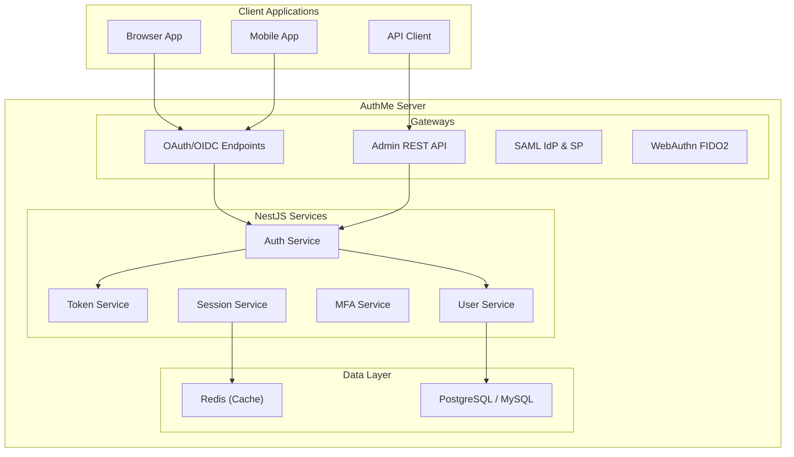

# AuthMe

  

  <strong>Open-Source Identity & Access Management</strong> 
  Self-hosted authentication server with OAuth 2.0, OpenID Connect, SAML 2.0, WebAuthn, and more.

---

## What is AuthMe?

AuthMe is a modern, lightweight identity and access management (IAM) server built for teams that need enterprise-grade authentication without enterprise complexity.

Most identity solutions are either:
- **Too complex** — Keycloak requires 1GB+ RAM and Java expertise
- **Too limited** — Simple JWT libraries lack production features

AuthMe fills that gap with a complete, self-hosted solution that deploys in under 30 seconds and runs in ~150MB RAM.

## Key Benefits

| Benefit | Description |
|---------|-------------|
| **Deploy in 30 seconds** | Single `docker compose up` gets you a full IAM server |
| **Modern stack** | TypeScript, NestJS, React, PostgreSQL — no Java, no XML |
| **Lightweight** | Runs in ~150 MB RAM vs. Keycloak's 1 GB+ |
| **Complete** | OAuth 2.0, OIDC, SAML 2.0, WebAuthn, MFA, LDAP, SSO, Organizations |
| **Extensible** | Plugin system, custom auth flows, webhooks, and 7 client SDKs |
| **Admin Console** | Full-featured React dashboard at `/console` |

## Features Overview

### Authentication & Protocols

| Feature | Description |
|---------|-------------|
| **OAuth 2.0 / OpenID Connect** | Authorization Code (with PKCE), Client Credentials, Password, Refresh Token grants |
| **SAML 2.0** | Identity Provider and Service Provider with signed assertions |
| **WebAuthn / Passkeys** | FIDO2 passwordless authentication with biometric support |
| **Multi-Factor Authentication** | TOTP-based 2FA with QR provisioning and recovery codes |
| **Adaptive / Risk-Based Auth** | Impossible travel detection, IP reputation, device fingerprinting |
| **Social Login** | Broker external OIDC/SAML identity providers |
| **LDAP User Federation** | Sync users from LDAP/Active Directory |
| **Custom Auth Flows** | Configurable multi-step authentication with branching |
| **Single Sign-On** | Browser-based SSO across all clients |

### Identity Management

| Feature | Description |
|---------|-------------|
| **Multi-Tenancy (Realms)** | Isolated tenants with independent configuration |
| **Organizations (B2B)** | Hierarchical organizations with member roles and SSO |
| **Role-Based Access Control** | Realm and client-level roles with user assignments |
| **Policy-Based Authorization** | Attribute-Based Access Control (ABAC) |
| **Groups** | Hierarchical groups with role inheritance |
| **Custom User Attributes** | Flexible schema with OIDC claim mapping |
| **Service Accounts & API Keys** | Backend authentication with key rotation |
| **Password Policies** | Complexity, history, and expiry requirements |
| **Email Verification** | Configurable flows via SMTP with themed templates |

### Operations & DevOps

| Feature | Description |
|---------|-------------|
| **Prometheus Metrics** | `/metrics` endpoint for Grafana dashboards |
| **Health Checks** | `/health/live` and `/health/ready` |
| **Structured Logging** | JSON logging with Pino |
| **Rate Limiting** | Configurable throttling per endpoint/client/user |
| **Horizontal Scaling** | Stateless design for multi-instance deployment |
| **Redis Support** | Optional shared session storage |
| **Multi-Database** | PostgreSQL, MySQL, and SQLite support |

## Architecture Overview

AuthMe follows a modular NestJS architecture with clear separation of concerns:

## Supported Standards

| Standard | Support |
|----------|---------|
| OAuth 2.0 (RFC 6749) | Authorization Code, Client Credentials, Password, Refresh Token |
| PKCE (RFC 7636) | S256 method |
| OpenID Connect Core 1.0 | ID tokens, UserInfo, Discovery, Backchannel Logout |
| Device Authorization (RFC 8628) | Full device code flow |
| SAML 2.0 | SP-initiated SSO, signed assertions, metadata exchange |
| WebAuthn / FIDO2 | Credential registration, platform & roaming authenticators |
| TOTP (RFC 6238) | MFA with QR provisioning |
| Argon2id (RFC 9106) | Password hashing |

## Tech Stack

| Layer | Technology |
|-------|-----------|
| **Backend** | NestJS 11, TypeScript 5.7, Node.js 22 |
| **Database** | PostgreSQL 16 (primary), MySQL 8, SQLite — via Prisma 7 ORM |
| **Admin UI** | React 19, Vite 7, Tailwind CSS 4, React Query |
| **Auth Pages** | Handlebars SSR with per-realm theming |
| **Security** | Argon2id (passwords), JOSE (JWTs), Helmet (headers) |
| **Caching** | Redis with Sentinel HA support |
| **SDKs** | TypeScript, React, Next.js, Angular, Vue, Android, iOS |

## When to Use AuthMe

AuthMe is ideal when you need:

- ✅ Self-hosted identity management (no vendor lock-in)
- ✅ OAuth 2.0 / OIDC for modern applications
- ✅ SAML 2.0 for enterprise integration
- ✅ WebAuthn / Passkeys for passwordless authentication
- ✅ Multi-tenancy with isolated realms
- ✅ B2B features like organizations and SSO
- ✅ MFA with TOTP or WebAuthn
- ✅ LDAP integration for existing directory users
- ✅ Custom authentication flows
- ✅ Webhooks for event-driven architectures

## Next Steps

[**Quickstart**](/docs/quickstart)
Get up and running in 30 seconds with Docker

[**Installation**](/docs/getting-started/installation)
Detailed installation instructions for all platforms

[**SDK Guides**](/docs/guides/sdks/react)
Integrate AuthMe with your application

[**API Reference**](/docs/api)
Complete REST API documentation

---

  <a href="https://authme.dev">authme.dev</a> &middot;
  <a href="https://github.com/Islamawad132/Authme">GitHub</a> &middot;
  <a href="https://discord.gg/authme">Discord</a>

